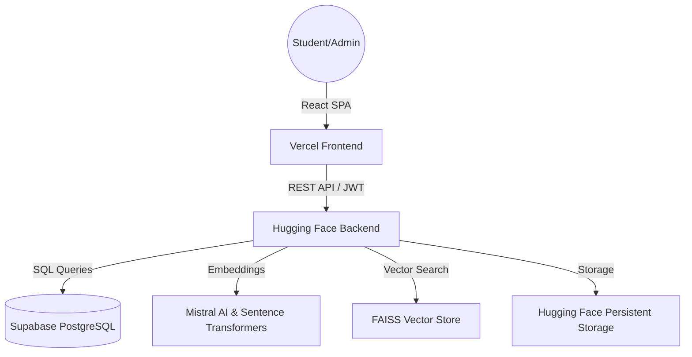

# 🎓 Campus Sphere — AI-Driven University Ecosystem

[](https://fastapi.tiangolo.com/)
[](https://reactjs.org/)
[](https://vercel.com/)
[](https://huggingface.co/spaces)
[](https://supabase.com/)
[](https://mistral.ai/)

**Campus Sphere** is a next-generation, AI-powered university management and engagement platform. It transforms the traditional campus experience into a high-density, interactive digital ecosystem, leveraging LLMs and RAG (Retrieval-Augmented Generation) to provide students and faculty with instant assistance and personalized recommendations.

---

## 🏗️ System Architecture

Campus Sphere uses a distributed architecture to ensure scalability and high performance.



---

## 🌟 Core Modules & Features

### 🤖 1. AI & Machine Learning Engine
*   **RAG-Powered Chatbot**: Beyond simple FAQs, our chatbot uses **Retrieval-Augmented Generation**. It indexes campus handbooks, course lists, and library data into a **FAISS vector store** to provide accurate, context-aware answers.
*   **Multi-Module Recommender**:
    *   **Clubs & Electives**: Uses **TF-IDF Vectorization** to match student skills and career goals with available opportunities.
    *   **Events**: A hybrid scoring system that considers student interests and historical engagement.
    *   **Library**: Recommends books by combining content similarity with real-time availability and popularity metrics.

### 🏢 2. International Relations Office (IRO) Portal
*   **Global Partner Hub**: Aggregated list of 100+ partner universities with categorized opportunities (Semester Exchange, Summer Immersion, Research).
*   **Application Lifecycle**: Complete workflow for students to apply for global programs, including personal statement uploads and CGPA validation.
*   **Admin Approval Suite**: Dedicated interface for IRO officers to review, waitlist, or approve applications.

### 📚 3. Intelligent Library & Services
*   **AI Search**: Search for books using natural language queries powered by semantic embeddings.
*   **Live Status**: Real-time tracking of book availability and location.
*   **Open Electives (OE)**: A smart selection tool that filters electives based on vacancy, department, and student profile fit.

### 👥 4. Community & Student Life
*   **Lost & Found Board**: A robust reporting system with:
    *   **Image Support**: Visual identification of lost items.
    *   **Approval Workflow**: Admin-moderated posts to prevent spam.
    *   **Status Tracking**: Items can be marked as "Open" or "Claimed" with timestamped logs.
*   **Campus Feed**: A category-based forum (General, Academic, Social) allowing students to post updates, share media, and interact through a liking system.

---

## 🚀 Tech Stack

### Backend (Python / FastAPI)
*   **FastAPI**: Asynchronous API layer for high concurrency.
*   **SQLAlchemy (Asyncpg)**: Modern async ORM for PostgreSQL interaction.
*   **Mistral AI**: Utilizing `mistral-medium` for advanced reasoning and response generation.
*   **FAISS**: High-speed vector similarity search for the RAG system.
*   **Sentence-Transformers**: Generating 384-dimensional dense embeddings for campus data.

### Frontend (React / Vite)
*   **React 19**: Leveraging the latest concurrent rendering features.
*   **Tailored UI**: A high-density "Midnight Horizon" aesthetic using glassmorphism and custom CSS variables.
*   **Lucide React**: 500+ premium icons for a consistent visual language.
*   **React Router 7**: Managing complex dashboard states and nested routing.

---

## 🛠️ Installation & Setup

### Prerequisites
- Python 3.10+
- Node.js 18+
- Supabase Account (PostgreSQL)
- Mistral AI API Key

### 1. Backend Setup
```bash
# Clone and enter
git clone https://github.com/Rohittyogii/campus-sphere.git
cd campus-sphere

# Environment Setup
python -m venv venv
source venv/bin/activate
pip install -r requirements.txt

# Configuration
cp .env.example .env
# Required: DATABASE_URL, MISTRAL_API_KEY
```

### 2. Frontend Setup
```bash
cd frontend
npm install
npm run dev
```

---

## 🌐 Deployment

The project is architected for high availability and performance across a distributed cloud stack:

- **Frontend**: Deployed on **Vercel** for lightning-fast Edge delivery and seamless SPA performance.
- **Backend**: Hosted on **Hugging Face Spaces** (Docker environment), providing robust compute for AI and ML workloads.
- **Database**: Powered by **Supabase (PostgreSQL)**, offering a high-performance, managed relational database with real-time capabilities.

---

## 📄 License & Attribution
Distributed under the **MIT License**.

**Architected and Built by Rohit Kumar.**
*Engineering the future of education through data and AI.*
